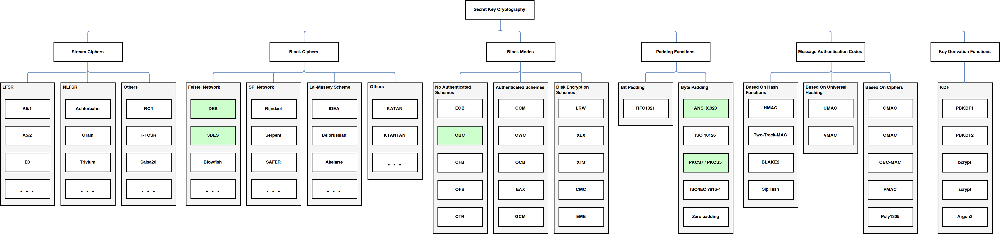

Julia Cryptography Package  
==========================

Cryptography.jl is a free Julia package of cryptographic schemes. This is intended to provide a reliable and stable base to study cryptography. It is not designed to compete in speed with other libraries, but on the contrary to facilitate the compression of the algorithms from an academic point of view. A central objective has been to provide a simple and coherent interface for similar classes of algorithms that share an abstract type in an idiomatic form for Julia.

Installation
------------

Design and architecture
-----------------------

Pseudo Random Number Generators (PRNG)
--------------------------------------

Hash Functions
--------------

Secret-Key Cryptography 
-----------------------

### Stream Ciphers

### Block Ciphers

### Block Modes Of Operation

### Padding Algorithms

### Message Authentication Codes (MAC)

### Password Based Key Derivation (KDF)

Public Key Cryptography
-----------------------

### Asymmetric Algorithms

### Digital Certificates

### Key Stores

### Digital Signatures

### Key Agreement Schemes

### Padding Schemes

### Cryptographic Message Syntax (CMS)

